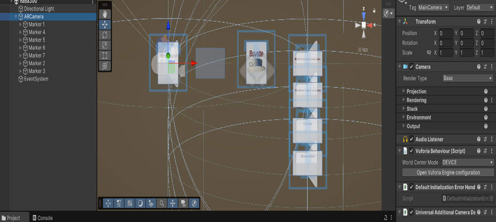
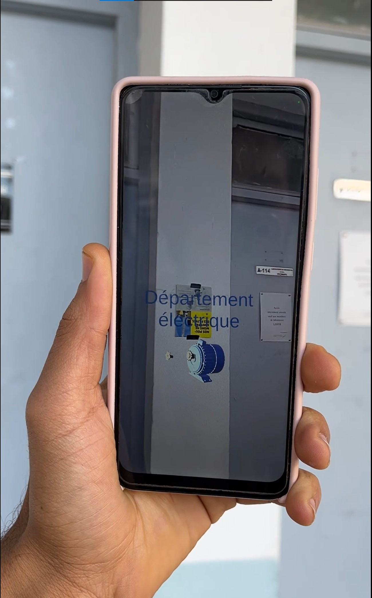
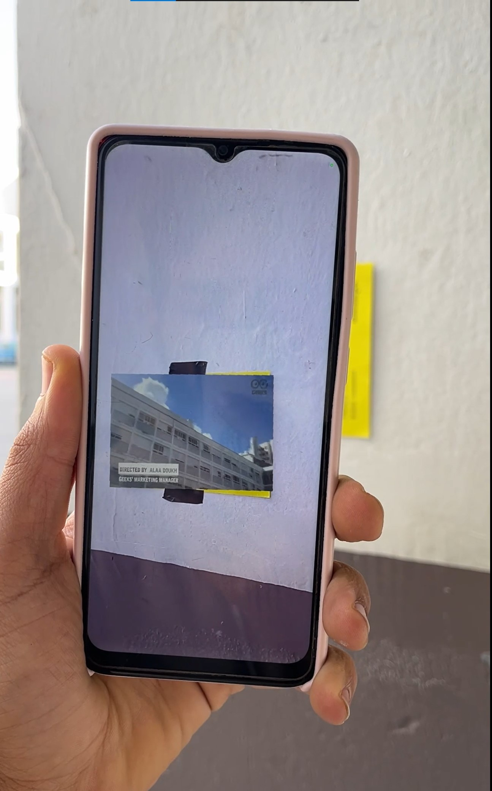
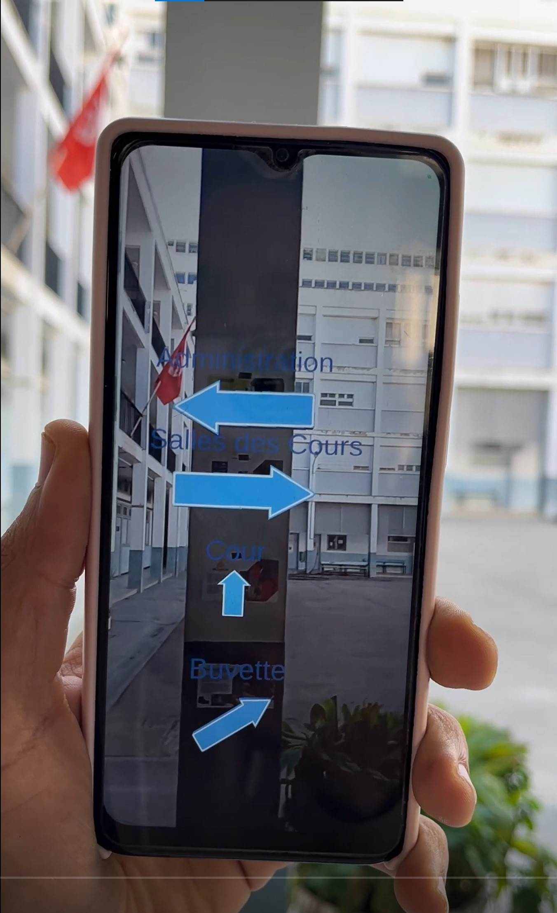

# Augmented-Reality-Campus-Guide-ENSIT-Bloc-A
An Augmented Reality guide built with Unity &amp; Vuforia to help new ENSIT students navigate Bloc A.
### *Mini-Project – Master IASRIA (2024–2025)*  
### Unity 3D + Vuforia AR

---

## 📌 Project Overview

This project consists of creating an **Augmented Reality (AR) application** showcasing **Bloc A of ENSIT** using **Unity 3D** and **Vuforia Engine**.

The goal was to build an immersive AR experience that allows users to:
- Visualize **3D elements**
- Display **textual information**

- Play an **embedded video**

- Follow **directional AR arrows**

- Recognize **image markers** associated with various elements of the school

This project was developed as part of the **Mini-Projet : Réalité Virtuelle** within the **Master IASRIA – ENSIT**.

---

## 🎯 Objectives

- Apply concepts of **AR development** using Unity and Vuforia  
- Create interactive digital content superimposed on real-world markers  
- Understand the workflow of **design → implementation → testing**  
- Build an educational AR experience for navigating ENSIT Bloc A  

---

## 🛠️ Technologies Used

### 🔹 Unity 3D  
A powerful cross-platform game engine used for:
- 3D/2D interactive content  
- C# scripting  
- Mobile deployment  
- Rendering and animation  

Unity was chosen for its flexibility, AR support, and strong development ecosystem.

### 🔹 Vuforia Engine  
An AR SDK integrated into Unity, offering:
- Image Target recognition  
- 3D object tracking  
- Video playback on markers  
- Precise spatial tracking  

Vuforia allowed us to connect real-world images with virtual content seamlessly.

---

## 🧩 Project Features

| Feature | Description |
|--------|-------------|
| 📌 **Image Tracking** | Multiple markers activate unique AR content |
| 🔺 **AR Navigation Arrows** | Arrows guide users to different rooms in Bloc A |
| 📝 **Text Augmentation** | Administrative info displayed via a marker |
| 🎥 **Video Integration** | A demonstration video plays when scanning a marker |
| ☕ **3D Object Placement** | A 3D cup and saucer appear through the buvette marker |
| ⚙️ **Vuforia Configuration** | Multi-target and marker management inside Unity |

---

